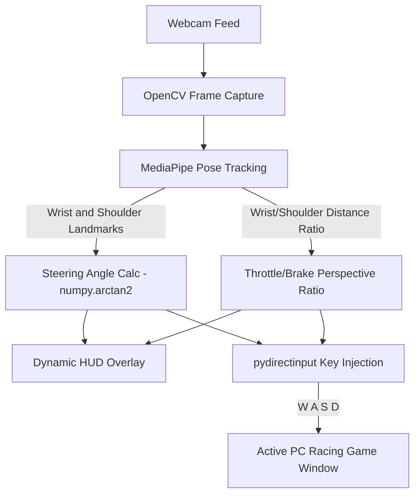
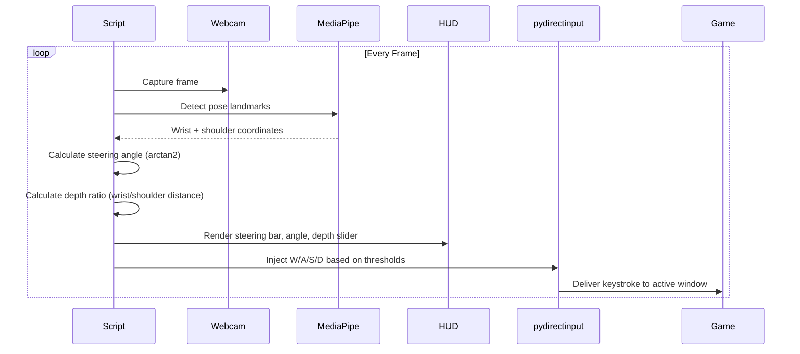

<div align="center">

# Virtual Steering Wheel

A self-contained Python script that turns a standard webcam into a virtual steering wheel and pedal system for PC racing games no simulator hardware required.


<br />


</div>

**Current Version:** 1.0.0
**Project Status:** Development / Production-Ready

---

## Overview

**What the project does:**
Virtual Steering Wheel uses full-body pose tracking via MediaPipe and OpenCV to translate wrist and shoulder movements into real-time WASD keyboard inputs for PC racing games.

**Why it was built & Problem it solves:**
Dedicated racing simulator hardware (wheels, pedals) is expensive and bulky. This script gives anyone with a webcam a motion-controlled steering and throttle experience using only body tracking and standard keyboard input injection.

**Target users:**
PC racing game players who want a hands-free, hardware-free steering experience using just a webcam.

**Key capabilities:**
- Full-body pose tracking that works even with closed fists or backlighting.
- Angle-based steering with an 8-degree tilt threshold.
- Depth-based throttle/brake using a 2D wrist-to-shoulder distance ratio.
- Zero-lag key injection directly into the active game window.

---

## Features

- **Fist & Low-Light Friendly:** Uses full-body Pose tracking instead of Hand tracking, so it works even with closed fists or backlighting.
- **Snappy Steering (Left/Right):** Calculates the angle between your wrists tilt past an 8-degree threshold to steer.
- **Intuitive Depth Throttle (Gas/Brake):** Push hands forward toward the camera to accelerate; pull them back toward your chest to brake.
- **Dynamic HUD:** On-screen UI with a virtual steering bar, angle readout, and a real-time depth slider for calibration.
- **Zero Input Lag:** Removes built-in safety delays in Python key injection for buttery-smooth, instantaneous game control.

---

## Tech Stack

| Technology | Purpose |
|------------|---------|
| Python 3 | Core script runtime |
| OpenCV (`opencv-python`) | Webcam capture and on-screen HUD rendering |
| MediaPipe Pose | Full-body landmark tracking (wrists, shoulders) |
| NumPy | Angle calculation (`arctan2`) for steering |
| pydirectinput | Low-level keyboard input injection into the active game window |

---

## Project Architecture

The script runs as a **single-process real-time loop**: capture → pose detection → gesture calculation → key injection.



- **Capture & Tracking:** OpenCV grabs webcam frames; MediaPipe Pose extracts wrist and shoulder landmarks per frame.
- **Gesture Calculation:** Steering angle from wrist tilt, throttle/brake from the 2D perspective ratio between wrist and shoulder distance.
- **Input Injection:** `pydirectinput` sends WASD keystrokes at the hardware level to whichever window is currently active.

---

## Folder Structure

```
virtual-steering-wheel/
└── virtual_steering_wheel.py    # Single self-contained script (capture, tracking, HUD, key injection)
```

---

## File Explanation

- **`virtual_steering_wheel.py`**: The entire application webcam capture loop, MediaPipe Pose tracking, steering angle and depth-ratio calculations, HUD rendering, and `pydirectinput` key injection all live in this single script.

---

## Prerequisites

- **Python 3** installed on your computer.
- A **webcam** positioned so it can see your shoulders and wrists.
- A PC racing game configured with standard **WASD** controls.

---

## Installation Guide

**1. Install dependencies**
```bash
pip install opencv-python mediapipe pydirectinput numpy
```

---

## Environment Variables

*This project requires no environment variables or `.env` configuration — all thresholds are defined as constants directly in `virtual_steering_wheel.py`.*

---

## Running the Project

```bash
python virtual_steering_wheel.py
```
A window titled "Virtual Steering Wheel" opens showing the live camera feed and HUD.

---

## Application Workflow

**Real-Time Control Loop**


**How to Play**
1. Launch the script; ensure the camera can see your shoulders and wrists.
2. Launch your racing game (Need for Speed, Forza, Assetto Corsa, Trackmania, etc.) with standard WASD controls.
3. Click into the game window so it's focused keystrokes are injected into the active window.
4. Hold your hands up as if gripping an invisible wheel.
5. Tilt hands left/right to steer; push forward to accelerate; pull back to brake.
6. Press **`q`** on the camera window to exit safely.

---

## Controls Reference

| Key | Action | Trigger |
|-----|--------|---------|
| `W` | Accelerate / Gas | Push hands forward toward the camera |
| `S` | Brake / Reverse | Pull hands back toward your chest |
| `A` | Steer Left | Tilt hands left past an 8-degree threshold |
| `D` | Steer Right | Tilt hands right past an 8-degree threshold |
| `q` | Quit | Press on the camera window to exit safely |

---

## How the Tech Works

- **Steering:** Calculates the angle of the line connecting your left and right wrists relative to the horizontal axis using `numpy.arctan2`.
- **Throttle/Braking:** Uses a robust 2D perspective ratio instead of noisy depth sensors it measures wrist-to-wrist distance relative to shoulder-to-shoulder distance. Camera perspective causes this ratio to increase as hands move toward the lens, reliably triggering the gas input.

---

## Configuration

- **Steering threshold:** 8-degree tilt angle before a turn registers.
- **Depth ratio thresholds:** Configurable gas/brake trigger points, visualized live on the HUD's depth slider.
- All thresholds are defined as constants at the top of `virtual_steering_wheel.py` for easy tuning.

---

## Build Instructions

*No build step required this is a single interpreted Python script run directly with `python virtual_steering_wheel.py`.*

---

## Deployment

*This is a local-only desktop utility; it is not deployed to a server. Distribute by sharing the script and the `pip install` command with other players.*

---

## Testing

*No automated test suite is configured. Validation is done by visually confirming HUD readouts (steering bar, angle, depth slider) match physical movement before playing.*

---

## Logging

- On-screen HUD displays live angle readout and depth slider as real-time visual feedback.
- Error states (e.g., no person detected) are rendered directly on the camera window rather than logged to a file.

---

## Error Handling

- **`ERROR: NO PERSON`**: Displayed on-screen when MediaPipe can't detect a person in frame.
- **`ERROR: SHOW WRISTS`**: Displayed when shoulders are visible but wrists are out of frame.
- The script continues running and re-evaluates each frame rather than crashing on a missed detection.

---

## Security

*Not applicable — this is a local, offline script with no network communication, accounts, or stored data.*

---

## Performance Optimizations

- **Zero Input Lag:** Removes `pydirectinput`'s built-in safety delay between keypresses for near-instantaneous response.
- **2D Perspective Ratio:** Avoids expensive/noisy depth-sensing in favor of a lightweight 2D distance calculation.

---

## Troubleshooting

- **`ERROR: NO PERSON` / `ERROR: SHOW WRISTS`**: Sit far enough back that the webcam can see both your shoulders and your hands.
- **Input isn't registering in the game**: Ensure the game window is actively selected/focused `pydirectinput` sends global keystrokes at the hardware level to the active window.

---

## Available Scripts

| Command | Location | Purpose |
|---------|----------|---------|
| `python virtual_steering_wheel.py` | root | Runs the steering wheel / pedal control script |

---

## Coding Standards

- **Formatting:** PEP 8-aligned Python formatting.
- **Naming Conventions:** snake_case for variables and functions.

---

## Contributing

1. Fork the Project
2. Create your Feature Branch (`git checkout -b feature/AmazingFeature`)
3. Commit your Changes (`git commit -m 'Add some AmazingFeature'`)
4. Push to the Branch (`git push origin feature/AmazingFeature`)
5. Open a Pull Request

---

## Roadmap

- [ ] Configurable key bindings beyond WASD.
- [ ] On-screen calibration wizard for steering/depth thresholds.
- [ ] Support for controller/gamepad emulation in addition to keyboard injection.
- [ ] Multi-camera / resolution auto-detection.

---

## Known Limitations

- **Single active window only:** Keystrokes are injected into whichever window is currently focused, not a specific game process.
- **No automated testing suite** currently in place.
- **Lighting/camera angle dependent:** Extreme backlighting or an obstructed shoulder/wrist view can still degrade tracking accuracy.

---

## License

This project is licensed under the MIT License.

---

## Author

- **Author Name:** Sakshya Patel
- **GitHub:** https://github.com/Sakshya10027
- **Portfolio:** https://animated-portfolio-tau-nine.vercel.app/

---

## Acknowledgements

- Pose tracking powered by [MediaPipe](https://developers.google.com/mediapipe)
- Computer vision via [OpenCV](https://opencv.org/)
- Keyboard input injection via [pydirectinput](https://pypi.org/project/PyDirectInput/)
